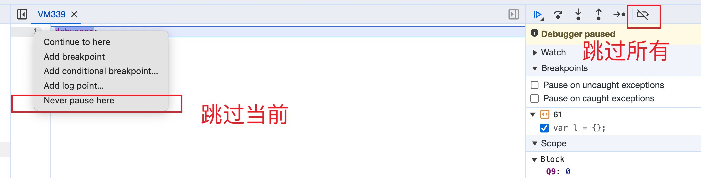

我们在调试JS代码的时候，经常会遇到一些无限debugger的情况，这时候我们就需要跳过这些debugger，继续执行代码。

### 使用Chrome DevTools 禁用断点

`Never pause here`选项可以禁用当前断点，注意如果当前行的代码发生变化，这个禁用会失效。
禁用所有断点我们一般不常用，因为这样会导致我们的断点失效，我们无法调试代码。

### 覆盖`debugger`语句
```
// 覆盖debugger，使其变成一个空函数
window.__debugger = window.debugger;
window.debugger = function() {}; // 现在debugger不会做任何事情
```
如果代码被混淆且debugger不是全局对象的属性，这种方法可能不起作用。

### 使用Chrome扩展插件
可以编写或找到一个Chrome扩展，这个扩展可以在运行JavaScript代码前修改或移除`debugger`语句。

### 使用Chrome DevTools Overrides 重写代码
利用`Chrome DevTools Overrides`功能，我们可以重写代码，直接把`debugger`语句删除掉。

### Hook原生方法
利用`hook`原生方法，我们可以在原生方法执行前，判断是否有`debugger`语句，如果有，我们就把`debugger`语句删除掉。
```jsx
_appendChild = Node.prototype.appendChild
Node.prototype.appendChild = function(){
    if (arguments[0].innerHTML && arguments[0].innerHTML.indexOf('debugger') != -1){
         arguments[0].innerHTML = ''
    }
    return _appendChild.apply(this, arguments)
}
```

```jsx
_Function = Function
Function.prototype.constructor = function(){
    if (arguments[0].indexOf('debugger') != -1){
            return _Function('')
        }
    return _Function(arguments[0])
}
```

```jsx
_eval = eval;
eval= function(){
    if ([arguments[0]].indexOf('debugger'))
    return eval(arguments[0])
}
```

### 使用自动化工具
对于经过混淆和保护的JavaScript代码，可能需要使用更高级的工具，如`JavaScript去混淆器（deobfuscators）`。
有些去混淆器可以自动识别并去除`debugger`语句。

### 注意
这些方法可以帮助你绕过或者删除`debugger`语句，但请记住，这样做可能会违反某些网站的使用条款或版权协议。
