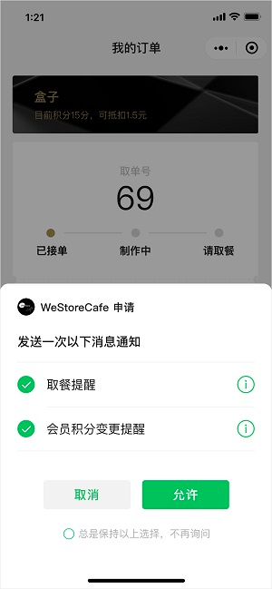
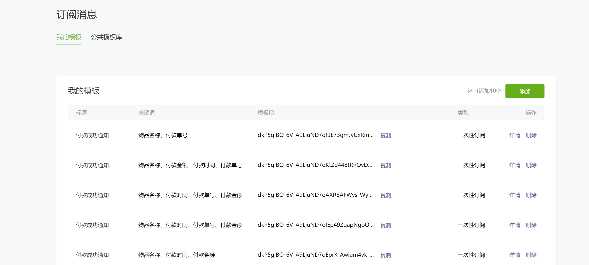

# 订阅消息

[微信小程序官方文档](https://developers.weixin.qq.com/miniprogram/dev/framework/open-ability/subscribe-message.html#%E8%AE%A2%E9%98%85%E6%B6%88%E6%81%AF%E8%AF%AD%E9%9F%B3%E6%8F%90%E9%86%92)

## 基本知识

订阅消息分三种

1. 一次性订阅, 每次订阅仅允许发送一条消息，每条消息可单独订阅或退订。
2. 长期订阅, 目前长期性订阅消息仅向政务民生、医疗、交通、金融、教育等线下公共服务开放
3. 设备订阅 ，属于长期订阅消息类型，需要完成 [设备接入](https://developers.weixin.qq.com/miniprogram/dev/framework/device/device-access.html)
   才能使用, 需要硬件设备。

目前我们只能使用一次性订阅消息，如果要想针对一个订单发送多次消息，只能让用户点击多次允许，或者引导用户点击“总是”

订阅实际上是订阅的消息模板，用户自主订阅后，开发者**仅可发送一条**模板对应的消息

用户发生点击行为或者发起支付回调后，才可以调起订阅消息界面

点击模板卡片后的跳转页面，仅限本小程序内的页面。

接口次数限制：开通支付能力的是3kw/日，没开通的是1kw/日。




例如用户点击允许后，后台可以向用户发送一条取餐提醒和一条积分提醒，再次发送将会报错

**一次允许最多订阅三条消息**

**“总是”勾选和不勾选唯一的区别就是每次触发订阅的时候会不会弹授权窗口,并不可以无限发送订阅消息**

## 使用说明

### 获取模板

登录 _https://mp.weixin.qq.com_ 查看模板，在公共模板库中选取合适的模板，点击选用，在我的模板中复制模板ID

**如果没有合适的模板，可以申请添加新模板，审核通过后可使用。但申请周期可能较长，且通过率不确定**

**每个模板Id对应的模板标题需要不相同，否则会被过滤。**

**不同服务类目的小程序看到的公共模板库不同，可在小程序设置中修改服务类目**



### 前端调用订阅界面

一次性订阅消息、长期订阅消息，[官方文档](https://developers.weixin.qq.com/miniprogram/dev/api/open-api/subscribe-message/wx.requestSubscribeMessage.html)

**一次调用最多可订阅3条消息。**
**（iOS客户端7.0.6版本、Android客户端7.0.7版本之后的一次性订阅/长期订阅才支持多个模板消息，iOS客户端7.0.5版本、Android客户端7.0.6版本之前的一次订阅只支持一个模板消息）**

#### 注意事项

- 一次性模板 id 和永久模板 id 不可同时使用。
- 低版本基础库2.4.4~2.8.3 已支持订阅消息接口调用，仅支持传入一个一次性 tmplId / 永久 tmplId。
- 2.8.2 版本开始，用户发生点击行为或者发起支付回调后，才可以调起订阅消息界面。
- 2.10.0 版本开始，开发版和体验版小程序将禁止使用模板消息 formId。
- 一次授权调用里，每个tmplId对应的模板标题不能存在相同的，若出现相同的，只保留一个。

设备订阅消息 [官方文档](https://developers.weixin.qq.com/miniprogram/dev/api/open-api/subscribe-message/wx.requestSubscribeDeviceMessage.html)

### 后端发送订阅消息

一次性订阅消息、长期订阅消息 [官方文档](https://developers.weixin.qq.com/miniprogram/dev/api-backend/open-api/subscribe-message/subscribeMessage.send.html)
设备订阅消息 [官方文档](https://developers.weixin.qq.com/miniprogram/dev/api-backend/open-api/hardware-device/hardwareDevice.send.html)

次数限制：开通支付能力的是3kw/日，没开通的是1kw/日。

订阅消息参数值内容有严格的长度格式限制，具体限制见[文档](https://developers.weixin.qq.com/miniprogram/dev/api-backend/open-api/subscribe-message/subscribeMessage.send.html)


### 订阅消息事件回调

**服务器地址在开发管理中设置**

存在三种回调

1、当用户触发订阅消息弹框后，用户的相关行为事件结果会推送至开发者所配置的服务器地址或微信云托管服务。

```json
{
  "ToUserName": "gh_123456789abc",
  "FromUserName": "o7esq5OI1Uej6Xixw1lA2H7XDVbc",
  "CreateTime": "1620973045",
  "MsgType": "event",
  "Event": "subscribe_msg_popup_event",
  "List": [
    {
      "TemplateId": "hD-ixGOhYmUfjOnI8MCzQMPshzGVeux_2vzyvQu7O68",
      "SubscribeStatusString": "accept",
      "PopupScene": "0"
    }
  ]
}

```


| 参数                    | 说明                      |
|:----------------------|:------------------------|
| ToUserName            | 小程序帐号ID                 |
| FromUserName          | 用户openid                |
| CreateTime            | 时间戳                     |
| TemplateId            | 模板id（一次订阅可能有多个id）       |
| SubscribeStatusString | 订阅结果（accept接收；reject拒收） |
| PopupScene            | 弹框场景，0代表在小程序页面内         |


2、当用户在手机端服务通知里消息卡片右上角“...”管理消息时，相应的行为事件会推送至开发者所配置的服务器地址或微信云托管服务。（目前只推送取消订阅的事件，即对消息设置“拒收”）

```json
{
      "ToUserName": "gh_123456789abc",
      "FromUserName": "o7esq5OI1Uej6Xixw1lA2H7XDVbc",
      "CreateTime": "1610968440",
      "MsgType": "event",
      "Event": "subscribe_msg_change_event",
      "List": [  {
                "TemplateId":"BEwX0BOT3MqK3Uc5oTU3CGBqzjpndk2jzUf7VfExd8",
                "SubscribeStatusString": "reject"
      }],
}

```

| 参数	                   | 说明                 |
|:----------------------|:-------------------|
| ToUserName	           | 小程序帐号ID            |
| FromUserName          | 	用户openid          |
| CreateTime            | 	时间戳               |
| TemplateId            | 	模板id（一次订阅可能有多个id） |
| SubscribeStatusString | 	订阅结果（reject拒收）    |

3、调用订阅消息接口发送消息给用户的最终结果，会推送下发结果事件至开发者所配置的服务器地址或微信云托管服务。
```json
{
    "ToUserName": "gh_123456789abc",
    "FromUserName": "o7esq5PHRGBQYmeNyfG064wEFVpQ",
    "CreateTime": "1620963428",
    "MsgType": "event",
    "Event": "subscribe_msg_sent_event",
    "List": {
        "TemplateId": "BEwX0BO-T3MqK3Uc5oTU3CGBqzjpndk2jzUf7VfExd8",
        "MsgID": "1864323726461255680",
        "ErrorCode": "0",
        "ErrorStatus": "success"
      }

}

```
| 参数	           | 说明                |
|:--------------|:------------------|
| ToUserName	   | 小程序帐号ID           |
| FromUserName	 | 用户openid          |
| CreateTime	   | 时间戳               |
| TemplateId	   | 模板id（一次订阅可能有多个id） |
| MsgID	        | 消息id（调用接口时也会返回）   |
| ErrorCode	    | 推送结果状态码（0表示成功）    |
| ErrorStatus	  | 推送结果状态码对应的含义      |

**失败仅包含因异步推送导致的系统失败**


### 订阅消息语音提醒
从基础库 2.18.0 开始支持

