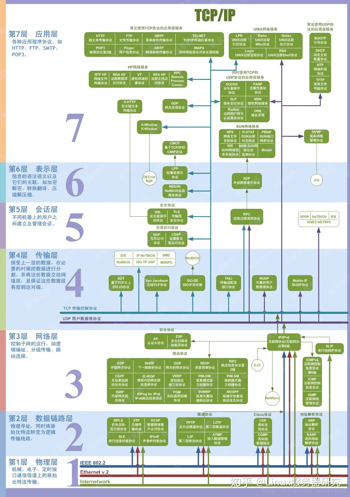

# 七层协议

## 停等协议

## 拥塞控制

一种用来调整TCP连接单次发送的分组数量（单次发送量）的算法。它通过增减单次发送量逐步调整，
使其逼近当前网络的承载量，如果单次发送量为1，此协议就退化为停等协议。

单次发送量是以字节来做单位的

如果假设TCP每次传输都是按照最大报文数来发送数据的，那么也可以把数据包个数当做单次发送量的单位，
所以有时我们说单次发送量1也就是增加相当于1个最大报文段的字节数

### 算法

拥塞控制假设分组的丢失都是由网络繁忙造成的。
拥塞控制有三种动作，分别对应主机感受到的情况：
1. 收到一条新确认。
2. 收到三条对同一分组的确认，即三条重复的确认。
3. 对某一条分组的确认迟迟未到，即超时。

当主机收到一条新确认时，可以增加单次发送量。当当前单次发送量小于倍增阈限，单次发送量加倍（X2），指数增长，
否则单次发送量加1，即线性增长。

当主机收到三条重复的确认时，单次发送量减半，倍增阈限等于单次发送量。

当主机检测到超时时，倍增阈限=单次发送量/2，单次发送量=1
